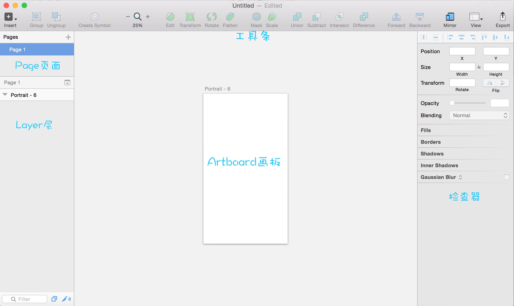

#Sketch学习笔记

* 点击Insert，选择shape，选取想要的形状，在画板上作出选中的图形。

* 右侧工具栏中的Fills可以选择填充颜色和方式，Boarders可以设置图形边框的颜色。

* 选中操作好的图形，点击上方的“Create Symbol”，这样就把刚作完的图形设置为一个标志。在这之后，点击Insert，选择Symbol，就会出现刚设的标志了。而对原标志的修改会使得新的symbol也会一并修改。

* 菜单栏中Insert —> text（快捷键 t），在画板上单击即可产生一个文本。对文本进行样式的修改，然后可以创建一个Text Style，同样可以快速应用设置好的Text Style。

* 画完之后点击右下角的“Make Exportable”，可以把作好的图片导出为@1x、@2x这样格式的图片。

* 菜单栏中File —> Revert To ，可以进行版本控制，返回同一文件之前的N个版本操作样式。

* 确定artBoard的大小，点击快捷键A（artBoard样式选择快捷键），右侧检查器区域则会出现默认的artBoard的尺寸。

* 检查器												1、通用属性：矩形的尺寸设置。                                                                   	2、样式属性：为矩形添加渐变和阴影；App背景：填充图片，模糊效果。

* 添加图形的时候，选择了矩形，在创建的时候按住shift，则能够画出一个正方形。要画出一个正圆形，道理同样，选择椭圆Oval后在创建的时候按住shift，就能画出一个正圆了。

* 添加完图形后，检查器的最上方会有对齐按钮，自动进行对齐操作。

* Fill中选择Pattern Fill，可以选择填充图片，再点击填满，就可以让图片去适应整个矩形框的大小。Fill中还有其他填充方式可以选择，但是还是颜色填充跟图案填充最为重用。

* 蒙板的使用：在画板上创建一个图形，选择想要的图片覆盖在其上方，右键layer中的图形，选择Use as Mask，这样图形就起到蒙板遮盖图片的效果。

* layer中把一个图形拉到另一个图形上就能够使两个图形合二为一。然后选中要对其做减法的图形，点击工具条中的subtract（抠掉），就只保留选择图形与另一图形不重叠的部分了。

* 自定义工具栏：在工具栏上右键，选择customize toolbar就可以把工具栏设置成自定义的工具栏了。
* 创建图形时按住option键，可以使创建图形起点为图形中心点。

* 同时按住command+option键，可以拖动被其他图层覆盖住的下方的图层。

* 按住option键，拖动图形可以实现复制，类似xcode中xib的操作。而command + D的作用是重复上一步的操作。

* 隐藏图层，只要点击layer层中的眼睛图标就可以了。

* 快捷键改变图形的大小：command + 方向键，每次数值+/-1，而command + shift + 方向键，每次数值+/-10。

* 右键layer中的图层，选择lock layer，则锁定此图层。

* 创建一个正方形（快捷键R），双击图层，正方形四角就会出现四个手柄，拖动手柄，修改图形形状，双击手柄可以修改手柄的类型，分为直线型、镜像型、未连接型和不对称型。

* Insert中选择vector（快捷键V），可以用向量来画线，未闭合的线可以选择顶部菜单选项layer—>path—>close path来闭合图形，而后可以选择填充色。双击线条，出现手柄，双击手柄，可以修改手柄位置。按住shift可以选择多个手柄。在线上单击可以添加手柄，按住command单击，可以保证新手柄在两个手柄的正中间。

* 创建两个图层，使其重叠，将两个图层在layer中拉到一起使其union，点击union图标，可以更改结合方式。

* 在蒙板效果中，添加文字会导致隐藏部分无法显示文字，这时候右键layer中的文字，选择最下方的ignore underlying mask，则可以使文字完全显示出来。

* 多个文本共用一个Style时，在某个文本处修改其样式，会导致整个Style发生改变，也就会使所有使用该Style的文本发生改变。解决办法就是将想要改变样式的文本设为No Text Style，然后再对其样式进行修改。

* 在文本内容上右键，选择最下的Convert To Outlines，这样文本就被转化成矢量了。

* 修改字体的两种方式：选中文本，在检查器中修改Typeface(字型)的值；右键font—>show fonts，然后选择想要的字体。

* 选中画板上的图片，右侧检查器中的Gaussian Blur（高斯模糊）可以进行图像模糊处理，Color Adjust可以进行颜色调校。

* 图片九切片处理：选中图片—>layer—>image—>Convert To 9-Slice Image

